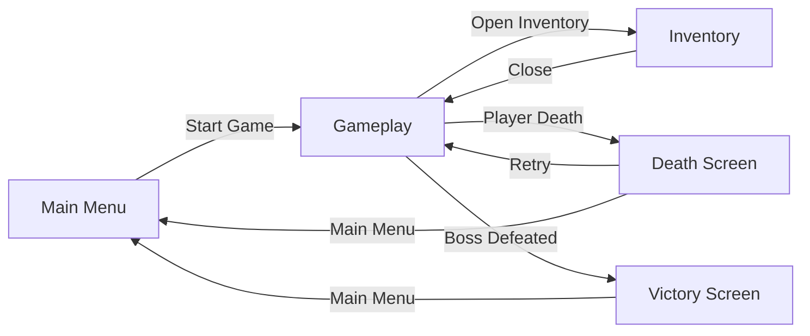
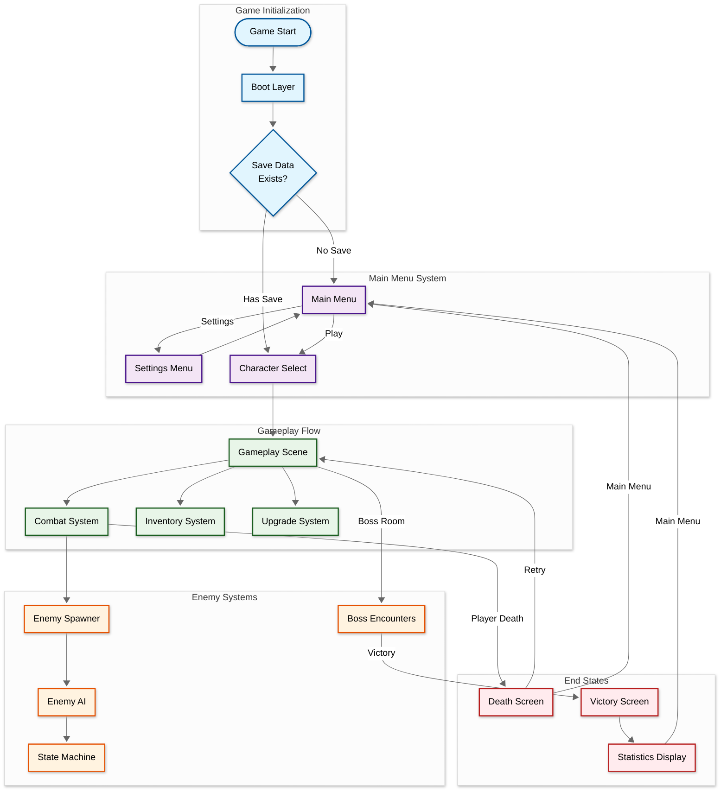
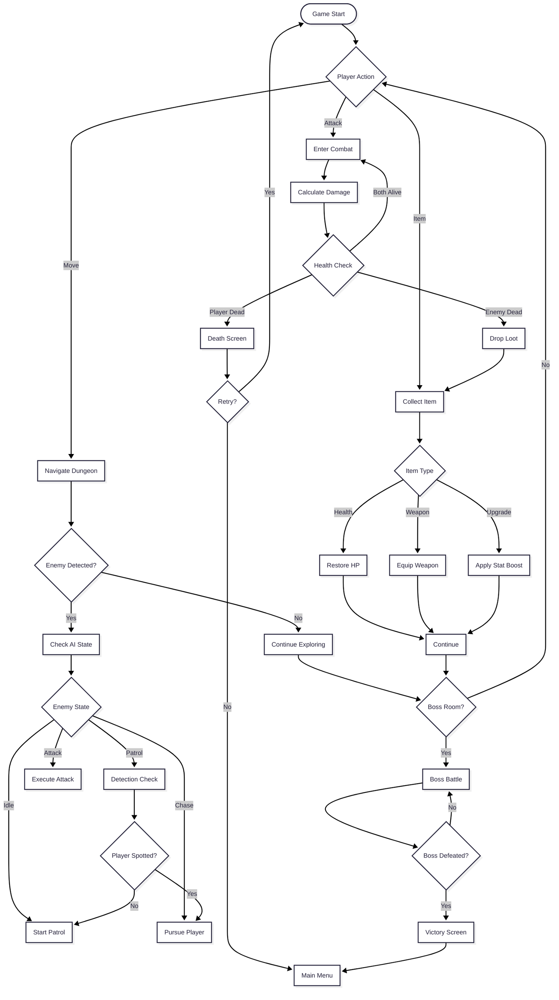
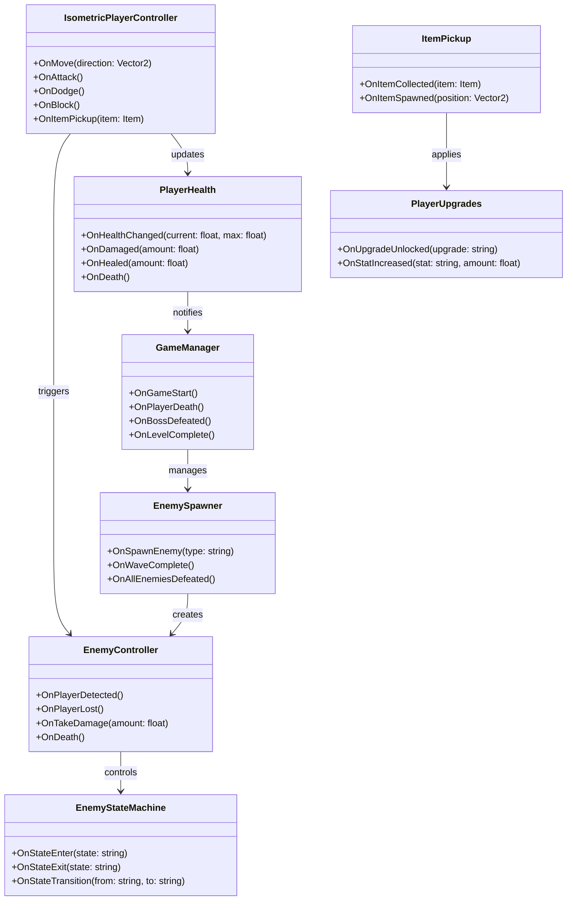

## Developer & Contributions

- Adiguna S Ligawan (Game Developer & Systems Designer)
   

## About

Dark Abyss is a top-down dungeon crawler inspired by classic 90s action RPGs like Diablo. Navigate through dark catacombs filled with deadly traps and relentless enemies. Master real-time combat with strategic movement, collect powerful items, and upgrade your character to survive increasingly challenging encounters. Face terrifying bosses in atmospheric dungeons where every step could be your last.
 

## Key Features

**Real-Time Combat System**: Fast-paced combat with attack combos, dodging, and blocking mechanics that reward skillful play and tactical positioning.

** Enemy AI**:  state machine driven enemies that patrol, chase, and attacks, creating dynamic and unpredictable encounters.

**Progressive Upgrade System**: Collect items and upgrades throughout your journey to enhance your character's abilities and survivability in the depths.

**Atmospheric Dungeon Crawling**: Explore procedurally-enhanced catacombs with strategic lighting, environmental traps, and hidden secrets.

 

<table>
  <tr>
    <td align="left" width="50%">
      
    </td>
    <td align="right" width="50%">
      
    </td>
  </tr>
</table>

## Scene Flow 

## Layer / Module Design 

## Modules and Features

A top-down dungeon crawler with real-time combat, strategic movement, and survival mechanics powered by a comprehensive enemy AI system that creates intense dungeon crawling experiences reminiscent of classic 90s action RPGs.

| 📂 Name | 🎬 Scene | 📋 Responsibility |
|---------|----------|-------------------|
| **Canvas** | **UI System** | - Render all UI elements - Handle UI scaling and positioning - Manage UI layers and sorting |
| **GameManager** | **Persistent** | - Manage game state and flow - Handle scene transitions - Track player progress and statistics |
| **EnemyController** | **Gameplay** | - Control enemy movement and behavior - Handle enemy combat mechanics - Process AI decision making |
| **EnemySpawner** | **Gameplay** | - Spawn enemies at designated points - Manage spawn rates and patterns - Control enemy population limits |
| **EnemyStateMachineBehaviours** | **Gameplay** | - Define enemy AI states (Idle, Patrol, Chase, Attack) - Handle state transitions - Execute state-specific behaviors |
| **HealthBar** | **UI/Gameplay** | - Display player and enemy health - Update health visuals in real-time - Show damage feedback |
| **IsometricPlayerController** | **Gameplay** | - Handle player movement in isometric view - Process combat inputs (attack, dodge, block) - Manage player physics and collisions |
| **ItemPickup** | **Gameplay** | - Handle item collection mechanics - Apply item effects to player - Manage item spawning and despawning |
| **Items** | **Gameplay** | - Store item data and properties - Define item types (weapons, potions, upgrades) - Handle item interactions |
| **PlayerHealth** | **Gameplay** | - Track player health and damage - Handle death and respawn logic - Manage healing and damage reduction |
| **PlayerUpgrades** | **Gameplay** | - Store and apply character upgrades - Calculate stat modifiers - Handle upgrade progression system |

 

## Game Flow Chart

 

## Event Signal Diagram

 

